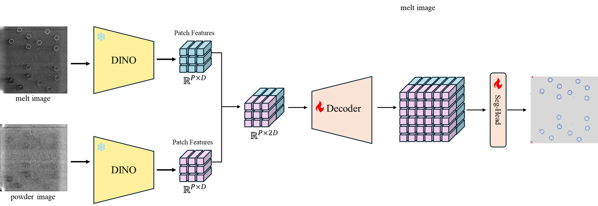
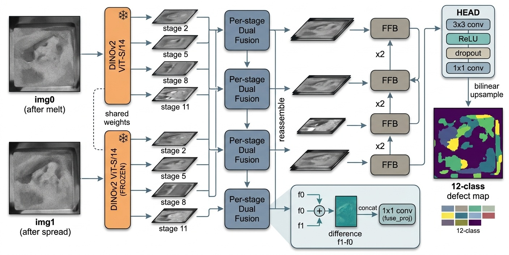

# DefSeg-AM

**L-PBF(Laser Powder Bed Fusion) 적층제조 공정의 layer-wise powder bed 카메라 이미지에서
결함을 픽셀 단위로 분할(semantic segmentation)** 하는 딥러닝 모델.

ORNL Peregrine in-situ 모니터링으로 매 layer 마다 촬영된 두 장의 visible 이미지
— **녹임 직후(after melt)** 와 **분말 도포 직후(after spread)** — 를 입력으로 받아,
각 픽셀을 정상(Powder/Printed) 또는 결함 종류(Recoater 교란·Spatter·Swelling·Over Melting 등)로
분류한 **결함 맵**을 출력한다. 적층 중 발생하는 결함을 layer 단위로 자동 검출/분류하여
공정 품질 모니터링과 후속 기계적 물성 예측의 기반 자료로 쓰는 것이 목표다.

> 입력 dual 이미지 → DINOv2(frozen) ×2 → 차이 융합 → 다중 해상도 → top-down 융합 → 분류 → 원본 크기 결함 맵

---

## 1. 모델 개요 (high-level)



| 구분 | 내용 |
|---|---|
| **입력** | dual visible — `melt image`(녹임 후) + `powder image`(도포 후), 각 1036×1036 |
| **Backbone** | **DINOv2 ViT-S/14 (frozen)** — 두 이미지에 동일 가중치 공유, patch feature `ℝ^{P×D}` (D=384) 추출 |
| **Fusion** | 두 patch feature 를 합쳐 `ℝ^{P×2D}` 로 결합 (melt↔spread 변화 단서 주입) |
| **Decoder** | DPT-style multi-scale decoder — 외부 의존 없는 자체 구현 |
| **Classifier** | 픽셀별 class logits → 결함 맵 |

핵심 아이디어는 **사전학습된 DINOv2 표현을 그대로 얼려 쓰고(frozen)**, 가벼운 DPT 디코더만 학습해
두 시점(melt/spread) 사이의 **차이(f1−f0)** 를 명시적으로 결함 단서로 활용하는 것이다.

---

## 2. 모델 구조 (detail)



DINOv2 ViT-S/14 의 4개 중간 stage(block `2,5,8,11`)에서 token feature 를 뽑아
DPT 디코더로 결함 맵을 복원한다. 전 과정은 입력 1036×1036, patch grid 74×74 기준.

1. **Dual backbone (frozen, weight-shared)** — `img0`/`img1` 각각에서 stage 2·5·8·11 의
   intermediate token 4-stage 추출 → 각 `(384, 74, 74)`.
2. **Per-stage Dual Fusion** — stage 마다 `concat(f0, f1, f1−f0)` (→ `1152ch`) 를
   `1×1 conv(fuse_proj)` 로 `256ch` 압축. **`f1−f0` (melt↔spread 변화량)** 를 결함 단서로 직접 주입.
3. **Reassemble** — 4 stage 를 서로 다른 해상도 피라미드로 변환
   (296 / 148 / 74 / 37) — DPT top-down 융합의 skip 해상도에 정확히 맞춘 값.
4. **Top-down Feature Fusion (FFB ×4)** — 가장 거친 s4(37×37)부터 ×2 씩 upsample 하며
   skip 을 더해 `(256, 592, 592)` 로 복원.
5. **Head** — `3×3 conv → ReLU → Dropout → 1×1 conv` 로 class logits 생성 후
   bilinear 로 입력 크기(1036×1036)로 복원 → 결함 맵.

학습 대상은 `fuse_proj`/`reassemble`/`fusion_blocks`/`head` 뿐이며 **backbone 은 frozen**.
체크포인트에도 이 trainable weight 만 저장한다.

> 텐서 크기 추적·FFB/RCU 내부·forward 코드 대응 등 상세는 [docs/MODEL_ARCHITECTURE.md](docs/MODEL_ARCHITECTURE.md) 참고.

### 2-Stage 학습

| Stage | 데이터 | 라벨 | 목적 |
|---|---|---|---|
| **S1 — KD pretrain** | ORNL Co-Registered HDF5 (5 빌드) | `slices/segmentation_results` (DSCNN 예측 mask) → argmax hard label | 도메인 대규모 사전학습 |
| **S2 — GT finetune** | DSCNN_Dataset annotations (human GT) | 사람 GT(native ID) → ORNL class 재매핑 | 소규모 진짜 GT 로 마무리 |

> S1 → S2 전환 시 backbone 은 frozen 유지, decoder/head weight 만 이어받고 optimizer 는 reset.

---

## 3. 저장소 구조

코드는 **공유(common) · v1 · v2** 세 영역으로 분리되어 있다.

```
DefSeg_AM/
├── common/    # ★ v1·v2 공유 코드
│   ├── config.py              # 경로·ORNL 라벨공간·DSCNN 매핑·backbone·출력경로 (공유 substrate)
│   ├── data/{image_utils.py, samplers.py}   # 이미지/라벨 유틸 + DDP WeightedSampler
│   ├── models/{model.py, losses.py}         # DefSegModel(DINOv2+DPT) + Focal/CE class-weight
│   ├── training/dist_utils.py               # DDP init / rank / all-reduce helper
│   └── utils/log.py
│
├── v1/        # 12-class (ORNL Peregrine 표준) — 원본 모델
│   ├── config.py  data/  training/  inference/  scripts/
│   └── README.md / PLAN.md / DEBUG_HISTORY.md
│
├── v2/        # 8-class (Recoater 통합 + 3종 제거) + 8-fold CV + DSCNN aug
│   ├── config_v2.py  data/  training/  inference/  scripts/  docker/
│   └── README.md / PLAN_v2.md
│
├── docs/          # 아키텍처 그림 + MODEL_ARCHITECTURE.md
├── cache/  checkpoints/  figures/  logs/   # (gitignore) v1·v2 공유 출력 (run-name 으로 구분)
├── paper/         # DSCNN 원 논문 + 클래스 정의
├── requirements.txt
└── venv/          # (gitignore) 호스트·컨테이너 공용
```

### 의존 방향
- **v1 → common**, **v2 → common**. v1 과 v2 는 서로를 임포트하지 않는다.
- `v2/config_v2.py` 는 `common/config.py` 의 공유 상수(경로·`MATERIAL_TO_ORNL`·`DSCNN_TRAIN_SOURCES` 등)를
  재사용하면서 8-class 재매핑·CV·aug 설정을 덧붙인다.
- 공유 모델/손실/샘플러/로깅/이미지 유틸/DDP helper 는 전부 `common/` 에 있다.

### v1 vs v2

| 항목 | v1 | v2 |
|---|---|---|
| Class | 12 (ORNL Peregrine) | 8 (Recoater 통합 + 3종 제거) |
| Stage 2 데이터 | LPBF 6 source (val 1개 고정) | LPBF + BJ 8 source, 8-fold CV |
| Augmentation | brightness jitter | D4 + cyclic shift + DSCNN noise/intensity |
| 모델 구조 | 공유 `common/models/model.py` (동일) | 〃 |

---

## 4. 실행
- v1: [v1/README.md](v1/README.md) — `python -m DefSeg_AM.v1.<module>`, `bash DefSeg_AM/v1/scripts/run_*.sh`
- v2: [v2/README.md](v2/README.md) — `python -m DefSeg_AM.v2.<module>`, `v2/docker/` compose

> 직접 모듈 호출 시 작업 디렉터리는 항상 저장소 루트(`3DP_VPPM/`) — `common/config.py` 의 상대 경로 기준.

## 5. 설치
```bash
# 저장소 루트(3DP_VPPM) 기준
python -m venv DefSeg_AM/venv
./DefSeg_AM/venv/bin/pip install -r DefSeg_AM/requirements.txt
```
DINOv2 backbone 은 최초 실행 시 `torch.hub` 로 자동 다운로드된다.
